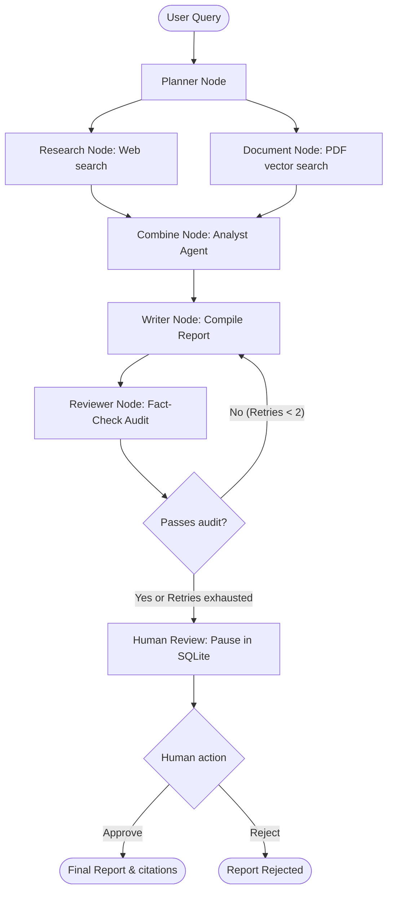

# Orchestrated Multi-Agent Research Assistant

An advanced, human-in-the-loop multi-agent research workflow built with **LangGraph**, **FastAPI**, and **Vite + React**. 

The assistant processes complex user queries by automatically generating a research plan, retrieving facts concurrently from both the web and a local vector document database, synthesizing evidence, compiling a Markdown report, fact-checking it with a dedicated auditor agent, and pausing for human review before finalization.

---

## Architecture Workflow



---

## Core Features

1. **Orchestrated Parallel Execution**: The **PlannerAgent** breaks the query into sub-questions, executing web search (Tavily) and private document retrieval (pgvector) in parallel branches.
2. **Fact Auditing & Retry Loop**: The **ReviewerAgent** fact-checks the Writer's draft against the core evidence list. If claims are unsupported, it rejects the draft, routing issues back to the Writer for a revision (capped at 2 retries).
3. **Persistent Human-in-the-Loop Pause**: The graph uses LangGraph's `interrupt()` and an SQLite checkpointer. The execution halts at the final stage, allowing the user to review the fact-check logs and approve/reject the report.
4. **Real-Time SSE Streaming**: Avoids blocking responses by using **Server-Sent Events (SSE)**. The frontend displays progressive task states ("Planner...", "Researching...", "Writing...") and data outputs in real-time.
5. **Token Cost Tracking**: Dynamically tracks prompt and completion tokens across all agent execution turns, calculating total execution cost in USD based on a model pricing registry.
6. **Multi-LLM Fallback**: Seamlessly falls back to OpenRouter models if direct Gemini API keys are unconfigured or fail.

---

## Project Structure

```
├── backend/
│   ├── app/
│   │   ├── agents/      # Planner, Research, Analyst, Writer, Reviewer agents
│   │   ├── core/        # Config, pricing registry, SSE managers
│   │   ├── routers/     # Research (stream), Reports (approve/reject), Ingestion APIs
│   │   └── graph.py     # LangGraph workflow definition and state schema
│   ├── tests/           # Unit tests (pricing, fallback, ingestion)
│   └── main.py          # FastAPI application entrypoint
└── frontend/
    ├── src/             # React app & component stylesheets
    └── package.json
```

---

## Setup & Execution

### Prerequisites
* Python 3.10+
* Node.js 18+
* Tavily API Key (for web searches)
* Gemini API Key or OpenRouter API Key

### 1. Backend Setup

1. Navigate to the `backend` folder:
   ```bash
   cd backend
   ```
2. Create and populate your `.env` file:
   ```env
   GEMINI_API_KEY=your-gemini-key
   OPENROUTER_API_KEY=your-openrouter-key
   TAVILY_API_KEY=your-tavily-key
   DATABASE_URL=your-neon-postgresql-connection-string
   ```
3. Activate the virtual environment and install dependencies:
   ```bash
   source ../.venv/bin/activate
   pip install -r requirements.txt
   ```
4. Start the FastAPI development server:
   ```bash
   uvicorn app.main:app --host 127.0.0.1 --port 8000 --reload
   ```

### 2. Frontend Setup

1. In a new terminal, navigate to the `frontend` folder:
   ```bash
   cd frontend
   ```
2. Install Node dependencies:
   ```bash
   npm install
   ```
3. Start the Vite React app:
   ```bash
   npm run dev
   ```
4. Open your browser and navigate to **`http://localhost:5173`**.

---

## Running Automated Tests

To run the automated tests verifying cost tracking and LLM fallback logic:

```bash
cd backend
../.venv/bin/python3 -m unittest tests/test_phase7.py -v
```
